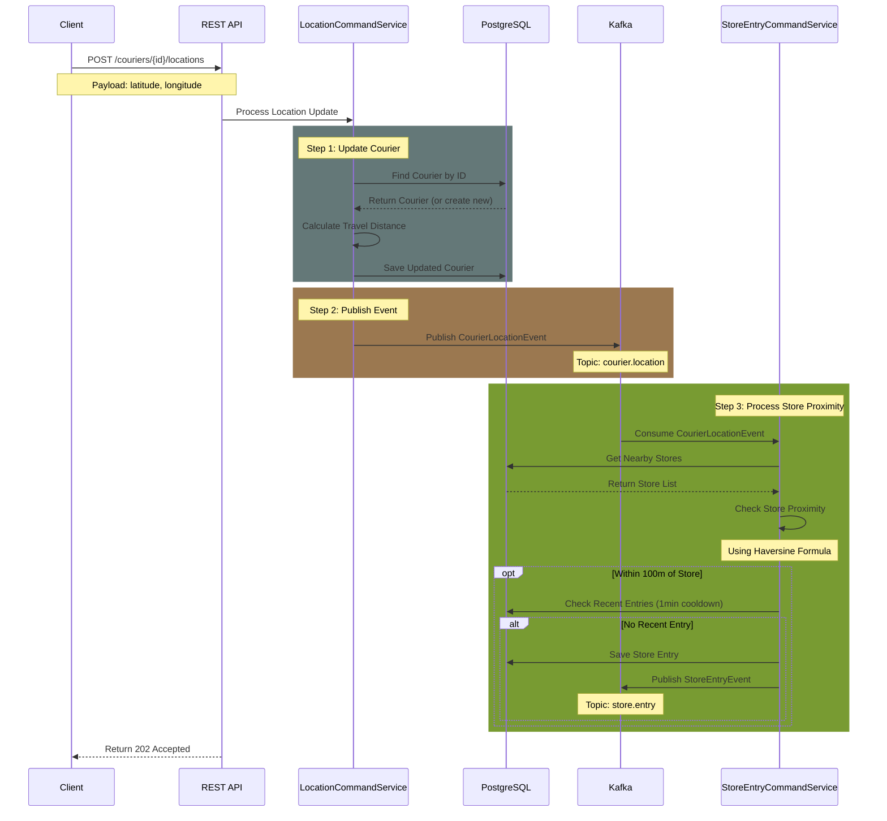

# Courier Tracking Service

A real-time courier tracking system that monitors courier locations, detects store proximity, and calculates travel distances. The system is built using a hybrid architecture combining CQRS (Command Query Responsibility Segregation) and Hexagonal Architecture patterns.

## Table of Contents
- [System Overview](#system-overview)
- [Architecture](#architecture)
- [Tech Stack](#tech-stack)
- [Event Flow](#event-flow)
- [Getting Started](#getting-started)
- [API Documentation](#api-documentation)
- [Testing](#testing)
- [Monitoring](#monitoring)
- [Development](#development)

## System Overview

The Courier Tracking Service provides the following core functionalities:
- Real-time courier location tracking
- Automatic store proximity detection (100m radius)
- Store entry logging with cooldown period (1 minute)
- Total travel distance calculation using Haversine formula
- Event-driven architecture using Kafka
- RESTful API endpoints

### Key Features
- Asynchronous event processing
- Geofencing capabilities
- Transaction-safe event publishing
- Retry mechanisms for failed operations
- Comprehensive logging and monitoring
- UTC timestamp handling

## Architecture

The application follows a hybrid architecture combining CQRS and Hexagonal Architecture patterns:

### Domain Layer (Core)
- Business logic and domain models
- Location and distance calculations
- Event definitions
- Repository interfaces

### Application Layer
- Command services for write operations
- Query services for read operations
- Event handlers and processors

### Infrastructure Layer
- REST controllers
- Kafka producers and consumers
- Database repositories
- Configuration classes

### Event Flow Diagram


## Tech Stack

### Core Technologies
- Java 21
- Spring Boot 3.2.1
- Spring Framework
- Apache Kafka
- PostgreSQL
- Docker & Docker Compose

### Libraries and Tools
- Spring Data JPA
- Spring Kafka
- Lombok
- Flyway (Database Migrations)
- SpringDoc OpenAPI (Swagger)
- SLF4J with Logback

### Development Tools
- Gradle (Build Tool)
- JUnit 5 (Testing)
- Testcontainers (Integration Testing)
- pgAdmin (Database Management)

## Getting Started

### Prerequisites
- Docker Desktop/Orbstack or any other docker engines
- Java 21 JDK
- Gradle 8.x

### One-Click Setup
1. Clone the repository:
```bash
git clone https://github.com/MelihCelik00/courier-tracking-service.git
cd courier-tracking-service
```

2. Start all services:
```bash
docker-compose up -d
```

3. Build and run the application:
```bash
./gradlew bootRun
```

The application will be available at:
- API: http://localhost:8080
- Swagger UI: http://localhost:8080/swagger-ui.html
- pgAdmin: http://localhost:5050

### Database Setup
pgAdmin credentials:
- Email: admin@admin.com
- Password: admin

To configure the database connection in pgAdmin:
1. Add new server:
   - Name: CourierTracking
   - Host: postgres
   - Port: 5432
   - Database: courier_tracking
   - Username: postgres
   - Password: postgres

## API Documentation

### REST Endpoints

#### Courier Location Update
```http
POST /api/v1/couriers/{id}/locations
```
Parameters:
- `id`: Courier ID (path parameter)
- `latitude`: Courier's latitude (query parameter)
- `longitude`: Courier's longitude (query parameter)

Example:
```bash
curl -X POST "http://localhost:8080/api/v1/couriers/1/locations?latitude=40.9923307&longitude=29.1244229"
```

#### Get Courier Details
```http
GET /api/v1/couriers/{id}
```
Example:
```bash
curl -X GET "http://localhost:8080/api/v1/couriers/1"
```

#### Get Total Travel Distance
```http
GET /api/v1/couriers/{id}/total-travel-distance
```
Example:
```bash
curl -X GET "http://localhost:8080/api/v1/couriers/1/total-travel-distance"
```

### Kafka Topics
- `courier.location`: Courier location updates
- `store.entry`: Store entry events

## Testing

### Integration Test Scenario
Test a courier approaching Ataşehir MMM Migros:
```bash
# Location 1 - 150m away from store
curl -X POST "http://localhost:8080/api/v1/couriers/1/locations?latitude=40.9923307&longitude=29.1234229"

# Location 2 - Within store radius (100m)
curl -X POST "http://localhost:8080/api/v1/couriers/1/locations?latitude=40.9923307&longitude=29.1244229"

# Location 3 - Moving away from store
curl -X POST "http://localhost:8080/api/v1/couriers/1/locations?latitude=40.9923307&longitude=29.1254229"
```  
Current test coverage: **86%**

### Monitoring
1. View Kafka messages:
```bash
docker-compose logs -f kafka
```

2. Check application logs:
```bash
docker-compose logs -f courier-tracking-service
```

3. Query store entries:
```sql
SELECT * FROM store_entry ORDER BY entry_time DESC;
```

## Development

### Project Structure
```
src/main/java/com/melihcelik/couriertracking/
├── application/
│   ├── command/
│   └── query/
├── domain/
│   ├── event/
│   ├── model/
│   ├── repository/
│   └── util/
└── infrastructure/
    ├── config/
    ├── messaging/
    └── rest/
```

### Key Components
- `CourierLocationCommandService`: Processes location updates
- `StoreEntryCommandService`: Handles store entry events
- `GeoUtils`: Haversine formula calculations
- `KafkaConfig`: Kafka configuration and retry policies

### Error Handling
- Transaction-safe event publishing
- Comprehensive error logging
- Cooldown period for store entries

### Shutdown
```bash
# Stop the application (Ctrl+C)

# Stop and remove containers
docker-compose down

# Remove volumes (optional)
docker-compose down -v
```

### Future Implementation Ideas
- Implement retry topics and mechanism (3 attempts with 1-second delay)
- Increase unit test coverage (Currently 86%)
- For a DDD approach, services could be separated into microservices
- More endpoints for a potential detailed business logic