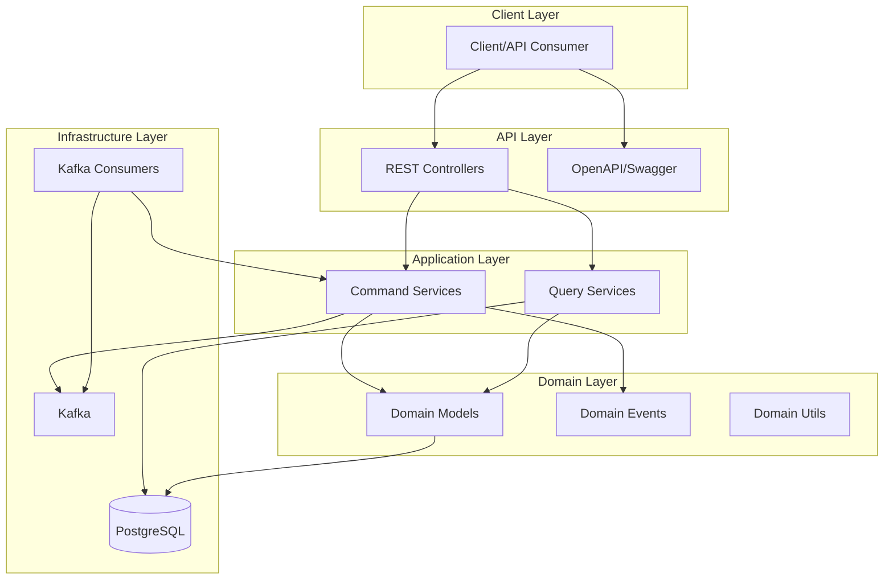
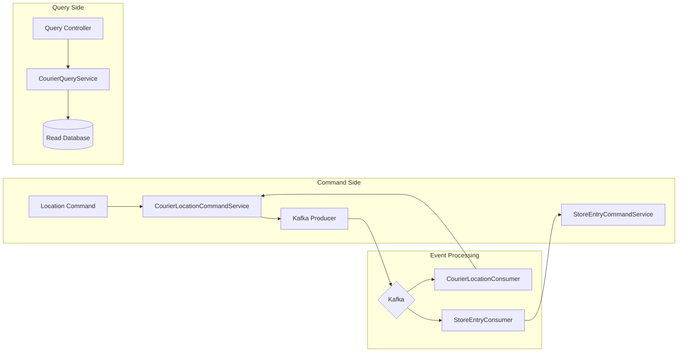
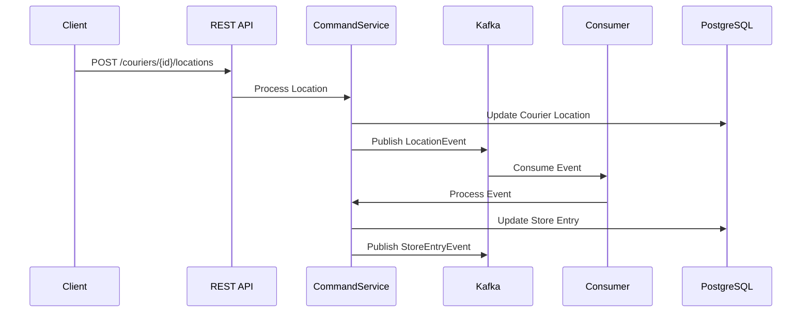
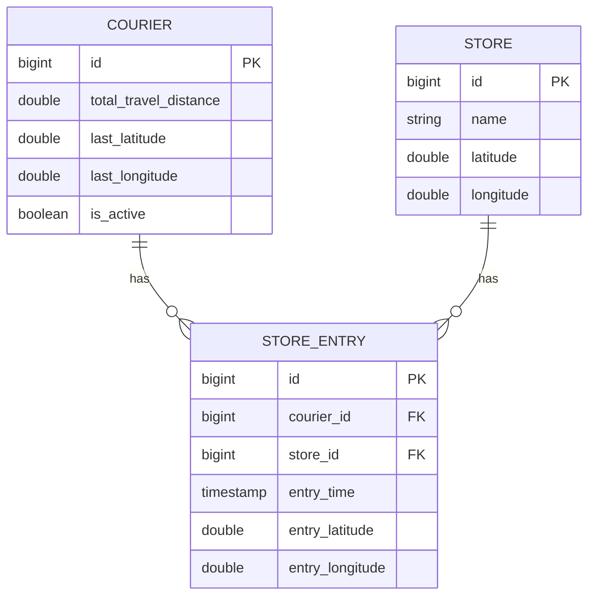

# System Architecture

## High-Level Architecture

## CQRS Pattern Implementation

## Event Flow

## Database Schema

## Component Details

### Domain Layer
- **Models**: Courier, Store, StoreEntry
- **Events**: CourierLocationEvent, StoreEntryEvent
- **Utils**: GeoUtils (Haversine calculations)

### Application Layer
- **Command Services**:
  - CourierLocationCommandService: Processes location updates
  - StoreEntryCommandService: Handles store entry events
- **Query Services**:
  - CourierQueryService: Retrieves courier information

### Infrastructure Layer
- **Messaging**:
  - Kafka for event streaming
  - Topics: courier.location, store.entry
- **Database**:
  - PostgreSQL for persistent storage
  - Flyway for migrations
- **API Documentation**:
  - OpenAPI/Swagger UI

### Features
- Real-time location tracking
- Automatic store proximity detection (100m radius)
- Store entry logging with cooldown (1 minute)
- Total travel distance calculation
- Event-driven architecture
- RESTful API endpoints 