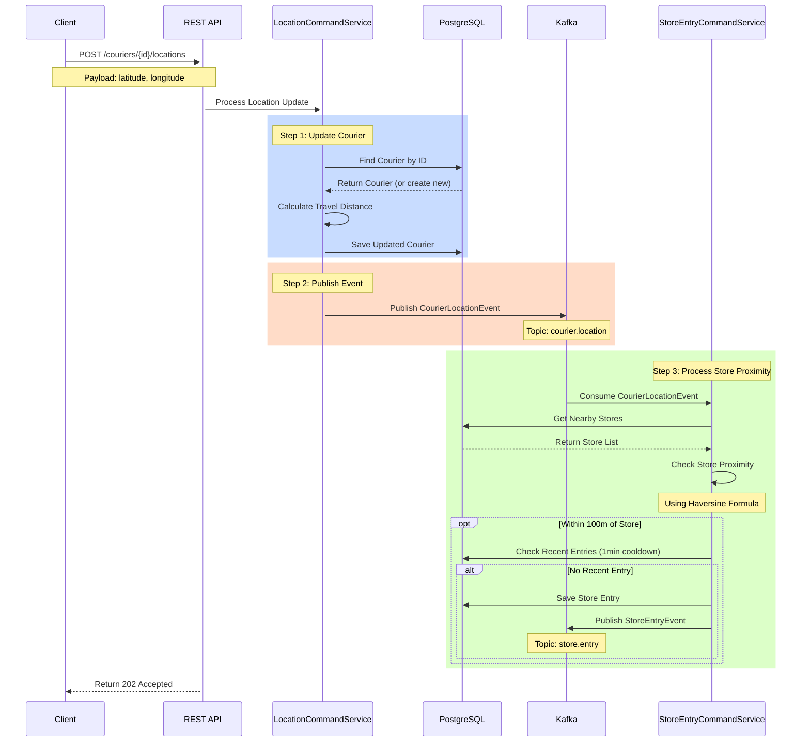

# Courier Location Event Lifecycle

## Event Flow


## Step-by-Step Explanation

### 1. Initial API Request
- Client sends POST request to `/api/v1/couriers/{id}/locations`
- Payload contains:
  ```json
  {
    "latitude": 40.9923307,
    "longitude": 29.1244229
  }
  ```

### 2. Location Command Service Processing
- **Courier Update**:
  - Finds or creates courier record
  - Calculates travel distance using previous location
  - Updates courier's total distance and current location
  - Saves to database

- **Event Publishing**:
  ```java
  CourierLocationEvent event = CourierLocationEvent.builder()
      .courierId(courierId)
      .latitude(latitude)
      .longitude(longitude)
      .timestamp(LocalDateTime.now())
      .build();
  ```
  - Publishes to `courier.location` Kafka topic

### 3. Store Entry Processing
- **Store Proximity Check**:
  - Retrieves all store locations
  - Uses Haversine formula to calculate distance
  - Checks if courier is within 100m radius

- **Entry Validation**:
  - Checks for recent entries (1-minute cooldown)
  - Prevents duplicate entries for same store

- **Store Entry Creation**:
  ```java
  StoreEntry entry = StoreEntry.builder()
      .courier(courier)
      .store(store)
      .entryTime(LocalDateTime.now())
      .entryLatitude(latitude)
      .entryLongitude(longitude)
      .build();
  ```

- **Event Publishing**:
  - Creates `StoreEntryEvent` if entry is logged
  - Publishes to `store.entry` Kafka topic

## Key Points
1. **Asynchronous Processing**: 
   - API returns immediately after publishing event
   - Store proximity check happens asynchronously

2. **Data Consistency**:
   - Courier location is updated immediately
   - Store entries are processed with cooldown check

3. **Event-Driven**:
   - Uses Kafka for decoupled processing
   - Enables system scalability

4. **Error Handling**:
   - Transactional processing in each service
   - Kafka ensures event delivery

## Database Interactions
1. **Courier Table**:
   - Updates location and distance
   - Tracks active status

2. **Store Entry Table**:
   - Records store visits
   - Maintains entry timestamps

3. **Store Table**:
   - Reference for proximity checks
   - Contains store coordinates 